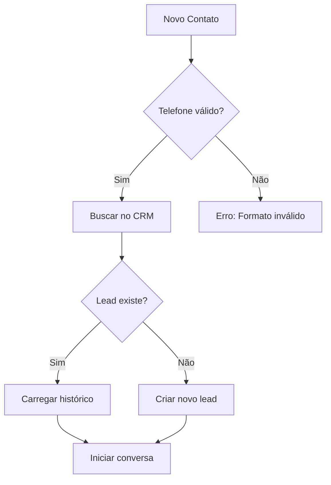
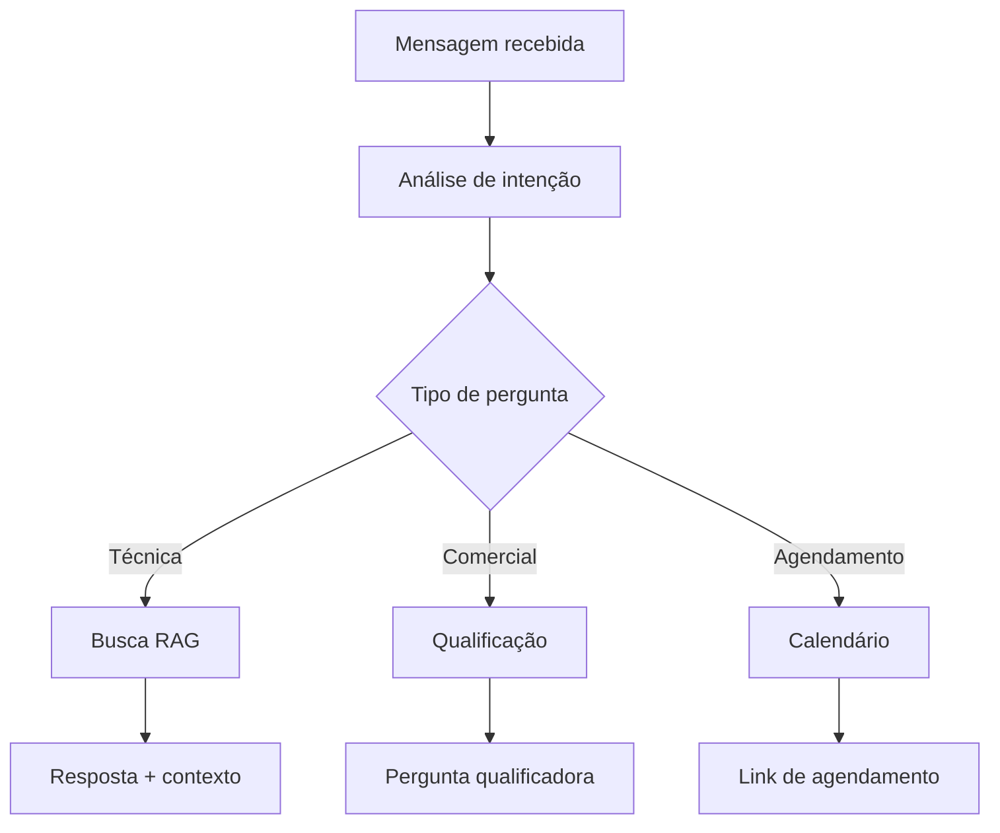
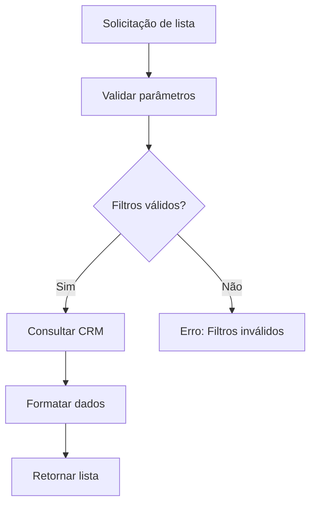

# 📋 Protocolo da API - Agente Mr. DOM360

## 🎯 Regras de Negócio para Integração Frontend

Este documento define as **regras de negócio** e **fluxos de integração** entre qualquer frontend e a API do Agente Mr. DOM360.

---

## 🤖 Visão Geral dos Agentes

### **SDR Agent** - Vendas e Qualificação
- **Função:** Qualificar leads, responder dúvidas comerciais, agendar diagnósticos
- **Endpoint:** `POST /sdr`
- **Comportamento:** Conversacional, empático, focado em vendas
- **Ferramentas:** RAG, CRM, Agendamento, Busca de leads

### **COPILOT Agent** - Operações Administrativas
- **Função:** Gerenciar CRM, listar dados, operações internas
- **Endpoint:** `POST /copilot`
- **Comportamento:** Técnico, direto, orientado a dados
- **Ferramentas:** CRM operations, Entity management, Data queries

---

## 📞 Fluxo de Conversa - SDR Agent

### 1. **Identificação do Lead**


### 2. **Processamento da Mensagem**


### 3. **Regras de Qualificação**

#### **Informações Obrigatórias:**
1. **Nome da empresa**
2. **Setor de atuação**
3. **Número de funcionários**
4. **Principal desafio/dor**
5. **Orçamento disponível**

#### **Estratégia de Coleta:**
- ✅ **Uma informação por vez** (não bombardear)
- ✅ **Perguntas contextuais** baseadas nas respostas
- ✅ **Validação gradual** do fit comercial
- ❌ **Nunca** pedir todas as informações de uma vez

### 4. **Fluxo de Agendamento**
```json
{
  "trigger": "palavras como 'agendar', 'reunião', 'diagnóstico'",
  "conditions": {
    "minimum_qualification": ["empresa", "setor", "desafio"],
    "interest_level": "medium_to_high"
  },
  "response": {
    "include_calendar_link": true,
    "personalized_message": true,
    "follow_up_instructions": true
  }
}
```

---

## 🔧 Fluxo Operacional - COPILOT Agent

### 1. **Consultas de Dados**
```javascript
// Exemplos de operações suportadas
const operations = [
  "Listar leads dos últimos 7 dias",
  "Buscar lead por telefone +5511999998888",
  "Criar novo lead com dados X",
  "Adicionar comentário no lead ID 123",
  "Listar entidades disponíveis no CRM"
];
```

### 2. **Fluxo de Listagem**


### 3. **Regras de Acesso**
- ✅ **Leitura:** Todos os dados do tenant
- ✅ **Escrita:** Apenas leads e comentários
- ❌ **Exclusão:** Não permitida via API
- ❌ **Dados sensíveis:** Filtrados automaticamente

---

## 🏗️ Estruturas de Dados

### **Request Padrão**
```json
{
  "request_id": "uuid_unique",           // Obrigatório: ID único da requisição
  "tenant": {                           // Obrigatório: Info do cliente
    "tenant_id": 1,
    "chatwoot_account_id": 1,
    "chatwoot_account_name": "Empresa",
    "chatwoot_host": "app.chatwoot.com"
  },
  "routing": {                          // Obrigatório: Roteamento
    "inbox_id": 27,
    "agent_type": "SDR" // ou "COPILOT"
  },
  "message": {                          // Obrigatório: Mensagem do usuário
    "content": "Texto da mensagem",
    "content_type": "text",
    "created_at": "2025-01-15T10:30:00Z"
  },
  "sender": {                           // Obrigatório para SDR
    "name": "Nome do contato",
    "phone_e164": "+5511999998888",
    "contact_id": 456                   // Opcional
  },
  "conversation": {                     // Obrigatório: Contexto
    "id": 789,
    "status": "open"
  },
  "rag_options": {                      // Opcional: Config. RAG
    "enabled": true,
    "top_k": 5,
    "return_chunks": true,
    "match_threshold": 0.7
  },
  "calendar_booking": {                 // Opcional: Agendamento
    "enabled": true,
    "booking_url": "https://calendly.com/empresa"
  }
}
```

### **Response Padrão**
```json
{
  "trace_id": "tr_abc123def456",        // ID para debugging
  "request_id": "req_12345",            // Echo do request_id
  "agent_output": {
    "text": "Resposta do agente",         // Texto principal
    "tool_calls": ["função1", "função2"], // Ferramentas usadas
    "rag_context": [                    // Contexto encontrado (se ativado)
      {
        "doc_id": "doc_001",
        "score": 0.85,
        "snippet": "Trecho relevante...",
        "source": "knowledge_base"
      }
    ],
    "structured": {}                    // Dados estruturados (futuro)
  },
  "usage": {                            // Métricas de uso
    "input_tokens": 150,
    "output_tokens": 75,
    "total_tokens": 225,
    "model": "amazon.nova-lite-v1:0"
  },
  "latency_ms": 850,                   // Performance
  "session": "cw:789",                 // ID da sessão
  "next_action": {                     // Ação recomendada
    "reply_to_user": true,
    "reply_type": "text"
  }
}
```

---

## 🔄 Estados de Conversa

### **Estados do Lead (SDR)**
```javascript
const leadStates = {
  "NEW": {
    action: "collect_basic_info",
    next: ["QUALIFYING", "UNQUALIFIED"]
  },
  "QUALIFYING": {
    action: "ask_qualifying_questions",
    next: ["QUALIFIED", "UNQUALIFIED", "NURTURING"]
  },
  "QUALIFIED": {
    action: "schedule_meeting",
    next: ["SCHEDULED", "NURTURING"]
  },
  "SCHEDULED": {
    action: "send_confirmation",
    next: ["COMPLETED", "RESCHEDULED"]
  },
  "NURTURING": {
    action: "provide_value",
    next: ["QUALIFYING", "UNQUALIFIED"]
  },
  "UNQUALIFIED": {
    action: "polite_dismissal",
    next: ["CLOSED"]
  }
};
```

### **Transições Automáticas**
- **NEW → QUALIFYING:** Primeira resposta válida
- **QUALIFYING → QUALIFIED:** ≥3 critérios atendidos
- **QUALIFYING → NURTURING:** Interesse mas sem fit imediato
- **QUALIFIED → SCHEDULED:** Aceite de agendamento
- **ANY → UNQUALIFIED:** Critérios não atendidos

---

## 📝 Regras de Conteúdo

### **Tone of Voice - SDR**
- ✅ **Empático e consultivo**
- ✅ **Focado em soluções**
- ✅ **Perguntas abertas**
- ✅ **Linguagem empresarial mas acessível**
- ❌ **Nunca** ser insistente ou agressivo
- ❌ **Não** usar jargão técnico excessivo

### **Tone of Voice - COPILOT**
- ✅ **Direto e objetivo**
- ✅ **Dados precisos**
- ✅ **Formato estruturado**
- ✅ **Terminologia técnica apropriada**

### **Exemplo SDR:**
```
❌ Ruim: "Preciso dos dados da sua empresa, setor, funcionários e orçamento."
✅ Bom: "Para entender melhor como podemos ajudar, me conte sobre o principal desafio que sua empresa enfrenta atualmente."
```

### **Exemplo COPILOT:**
```
❌ Ruim: "Vou verificar isso para você, aguarde um momento..."
✅ Bom: "Encontrados 15 leads criados nos últimos 7 dias. Filtros aplicados: status=novo, fonte=website."
```

---

## 🎯 Critérios de Qualificação

### **Matriz BANT Adaptada**

| Critério | Peso | Perguntas Sugeridas |
|----------|------|-------------------|
| **Budget** (25%) | Alto | "Qual investimento está considerando para resolver isso?" |
| **Authority** (30%) | Alto | "Quem participa da decisão de tecnologia na empresa?" |
| **Need** (35%) | Crítico | "Qual o principal desafio que vocês enfrentam?" |
| **Timeline** (10%) | Baixo | "Quando gostariam de implementar uma solução?" |

### **Scoring Automático**
```javascript
const calculateScore = (lead) => {
  let score = 0;
  
  // Setor (0-20 pontos)
  if (['tecnologia', 'saude', 'educacao'].includes(lead.sector)) score += 20;
  else if (['comercio', 'servicos'].includes(lead.sector)) score += 15;
  else score += 10;
  
  // Tamanho (0-25 pontos)
  if (lead.employees >= 50) score += 25;
  else if (lead.employees >= 10) score += 20;
  else if (lead.employees >= 2) score += 15;
  else score += 5;
  
  // Urgência (0-30 pontos)
  const urgencyKeywords = ['urgente', 'rapido', 'preciso agora'];
  if (urgencyKeywords.some(word => lead.message.includes(word))) score += 30;
  
  // Orçamento (0-25 pontos)
  if (lead.budget >= 10000) score += 25;
  else if (lead.budget >= 5000) score += 20;
  else if (lead.budget >= 1000) score += 15;
  
  return Math.min(score, 100);
};
```

### **Ações por Score**
- **90-100:** Agendar imediatamente
- **70-89:** Qualificar mais e agendar
- **50-69:** Nutrir com conteúdo
- **30-49:** Follow-up em 30 dias
- **0-29:** Desqualificar educadamente

---

## 🚀 Integração com Frontend

### **1. Inicialização da Conversa**
```javascript
// Sempre verificar saúde primeiro
const health = await fetch('/healthz');
if (!health.ok) throw new Error('Agent offline');

// Primeira mensagem
const response = await chatWithAgent({
  message: { content: userInput },
  sender: { phone_e164: userPhone },
  conversation: { id: generateConversationId() },
  // ... outros campos obrigatórios
});
```

### **2. Gestão de Estado**
```javascript
const conversationState = {
  lead_id: null,
  qualification_score: 0,
  collected_info: {},
  next_question: null,
  appointment_scheduled: false
};

// Atualizar após cada resposta
const updateState = (response) => {
  if (response.agent_output.structured.lead_id) {
    conversationState.lead_id = response.agent_output.structured.lead_id;
  }
  // ... outras atualizações
};
```

### **3. Tratamento de Erros**
```javascript
const handleApiError = (error) => {
  switch (error.code) {
    case 'INVALID_PHONE_FORMAT':
      return "Por favor, insira um telefone válido com DDD.";
    case 'AGENT_TYPE_MISMATCH':
      return "Erro de configuração. Tente novamente.";
    case 'KNOWLEDGE_BASE_UNAVAILABLE':
      return "Base de conhecimento temporariamente indisponível.";
    default:
      return "Erro interno. Nossa equipe foi notificada.";
  }
};
```

### **4. Interface Recomendada**
```html
<!-- Componentes essenciais -->
<div class="chat-container">
  <!-- Header com status do agente -->
  <header class="agent-status">
    <span class="status-indicator online"></span>
    <span>Mr. DOM360 - SDR Agent</span>
  </header>
  
  <!-- Lista de mensagens -->
  <div class="messages">
    <!-- Mensagens com indicadores de ferramentas -->
    <div class="message agent">
      <div class="content">Resposta do agente...</div>
      <div class="tools-used">🔍 Busca CRM, 📚 Base conhecimento</div>
    </div>
  </div>
  
  <!-- Input com indicadores -->
  <div class="input-area">
    <input type="text" placeholder="Digite sua mensagem..." />
    <div class="typing-indicator" hidden>Agente está digitando...</div>
  </div>
</div>
```

---

## 📊 Monitoramento e Analytics

### **Métricas Essenciais**
```javascript
const trackConversation = {
  // Performance
  latency: response.latency_ms,
  tokens_used: response.usage.total_tokens,
  
  // Qualificação
  qualification_score: calculateScore(lead),
  info_collected: Object.keys(lead.info).length,
  
  // Conversão
  appointment_scheduled: lead.status === 'SCHEDULED',
  conversation_length: messageCount,
  
  // Satisfação (inferida)
  positive_responses: countPositiveWords(messages),
  objections_handled: countObjections(messages)
};
```

### **Dashboard Recomendado**
- 📈 **Taxa de conversão** (leads → agendamentos)
- ⏱️ **Tempo médio** de qualificação
- 🎯 **Score médio** de leads qualificados
- 💬 **Satisfação inferida** das conversas
- 🔧 **Performance técnica** (latência, erros)

---

## 🛡️ Segurança e Compliance

### **Proteção de Dados**
- ✅ Telefones sempre em formato E.164
- ✅ Logs sanitizados (sem PII)
- ✅ Rate limiting por IP
- ✅ Trace IDs para auditoria
- ❌ **Nunca** armazenar dados sensíveis em logs

### **Validações Obrigatórias**
```python
def validate_request(data):
    # Telefone válido
    if not is_valid_e164(data.sender.phone_e164):
        raise InvalidPhoneError()
    
    # Tenant válido
    if not data.tenant.tenant_id:
        raise MissingTenantError()
    
    # Message não vazia
    if not data.message.content.strip():
        raise EmptyMessageError()
    
    return True
```

### **Compliance LGPD/GDPR**
- ✅ **Consentimento:** Sempre solicitar antes de armazenar
- ✅ **Minimização:** Coletar apenas dados necessários
- ✅ **Retenção:** Configurar TTL nos dados
- ✅ **Portabilidade:** API de exportação disponível
- ✅ **Exclusão:** Endpoint para right to be forgotten

---

## 🚧 Troubleshooting

### **Problemas Comuns**

#### **Agent não responde**
```bash
# Verificar saúde
curl http://localhost:8000/healthz

# Verificar logs
grep "ERROR" /var/log/dom360-sdr.log | tail -10

# Reiniciar se necessário
python main.py api
```

#### **Qualificação não funciona**
- ✅ Verificar formato do telefone (E.164)
- ✅ Confirmar acesso ao CRM
- ✅ Validar base de conhecimento
- ✅ Checar logs de tool calls

#### **RAG retorna resultados irrelevantes**
- ✅ Ajustar `match_threshold` (0.7 → 0.8)
- ✅ Reduzir `top_k` (5 → 3)
- ✅ Verificar qualidade dos embeddings
- ✅ Atualizar base de conhecimento

### **Códigos de Debug**
```python
# Ativar debug completo
import logging
logging.getLogger('agno').setLevel(logging.DEBUG)

# Trace específico
logger.info(f"Processing request {request_id} for {phone}")

# Performance monitoring
start_time = time.time()
# ... processamento ...
latency = (time.time() - start_time) * 1000
logger.info(f"Request {request_id} completed in {latency}ms")
```

---

## 📋 Checklist de Integração

### **Frontend Development**
- [ ] Implementar health check na inicialização
- [ ] Validar formato de telefone no frontend
- [ ] Tratar todos os códigos de erro da API
- [ ] Implementar retry com backoff exponencial
- [ ] Adicionar loading states e typing indicators
- [ ] Capturar métricas de performance
- [ ] Implementar fallbacks para falhas da API

### **Backend Configuration**
- [ ] Configurar variáveis de ambiente
- [ ] Testar conexão com AWS Bedrock
- [ ] Validar integração com Supabase
- [ ] Configurar Vtiger CRM (opcional)
- [ ] Ativar logs estruturados
- [ ] Configurar rate limiting
- [ ] Implementar health checks

### **Production Deployment**
- [ ] Configurar HTTPS/TLS
- [ ] Implementar load balancer
- [ ] Configurar monitoramento (Grafana/Prometheus)
- [ ] Configurar alertas de erro
- [ ] Backup da base de conhecimento
- [ ] Documentar procedimentos de recovery
- [ ] Testar disaster recovery

---

**🔄 Versão do Protocolo:** 1.0  
**📅 Data:** 15 de Janeiro de 2025  
**👨‍💻 Autor:** DOM360 Development Team  
**📄 Documento:** Protocolo de Integração API