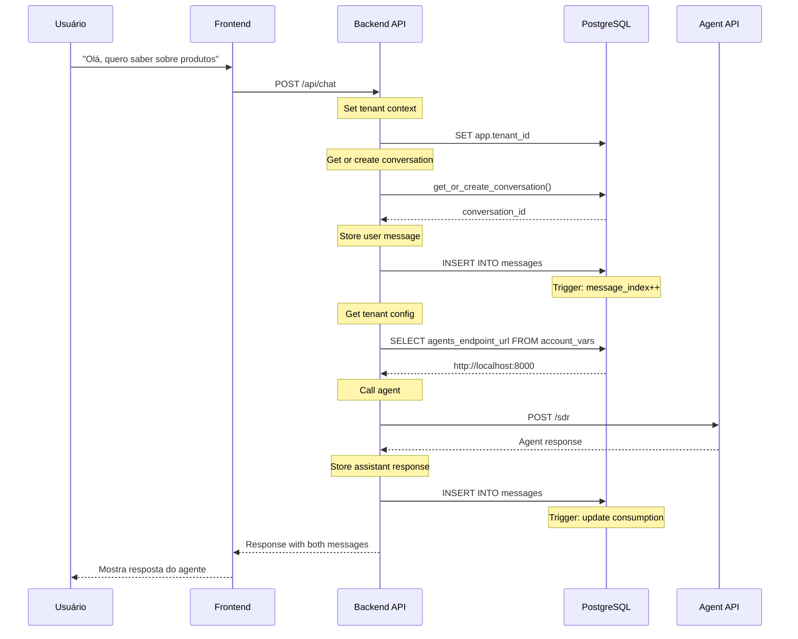

# 🏗️ Arquitetura DOM360 - Diagrama Visual

## 📐 Visão Geral do Sistema

```
┌─────────────────────────────────────────────────────────────────────────────┐
│                         DOM360 MULTI-AGENT SYSTEM                           │
└─────────────────────────────────────────────────────────────────────────────┘

┌──────────────┐         ┌──────────────┐         ┌──────────────┐
│   Frontend   │         │   Backend    │         │  PostgreSQL  │
│    React     │◄───────►│  Express API │◄───────►│   Database   │
│  Port 5173   │  HTTP   │  Port 3001   │  pg     │  Port 5432   │
└──────────────┘         └──────┬───────┘         └──────────────┘
                                │
                                │ HTTP
                                ▼
                         ┌──────────────┐
                         │  Agent API   │
                         │  SDR/COPILOT │
                         │  Port 8000   │
                         └──────────────┘
```

---

## 🔄 Fluxo de Dados Completo

### 1. Usuário Envia Mensagem



---

## 🗄️ Arquitetura do Banco de Dados

### Camadas de Dados

```
┌─────────────────────────────────────────────────────────────────┐
│                         Application Layer                        │
│  ┌────────────┐  ┌────────────┐  ┌────────────┐               │
│  │  Frontend  │  │  Backend   │  │   Admin    │               │
│  └─────┬──────┘  └─────┬──────┘  └─────┬──────┘               │
└────────┼────────────────┼────────────────┼──────────────────────┘
         │                │                │
         └────────────────┼────────────────┘
                          │
┌─────────────────────────▼─────────────────────────────────────┐
│                     Row Level Security (RLS)                   │
│  ┌──────────────────────────────────────────────────────────┐ │
│  │  app.tenant_id = current_setting('app.tenant_id')       │ │
│  └──────────────────────────────────────────────────────────┘ │
└────────────────────────────────────────────────────────────────┘
                          │
┌─────────────────────────▼─────────────────────────────────────┐
│                      Data Layer (Tables)                       │
│                                                                │
│  ┌─────────┐   ┌──────────┐   ┌──────────────┐              │
│  │ tenants │──►│  users   │   │  account_vars │              │
│  └─────────┘   └──────────┘   └──────────────┘              │
│       │                                                        │
│       ├────────────┬───────────────┐                          │
│       │            │               │                          │
│  ┌────▼────┐  ┌───▼────┐    ┌─────▼──────┐                  │
│  │ inboxes │  │ agents │    │conversations│                  │
│  └────┬────┘  └────────┘    └─────┬──────┘                  │
│       │                            │                          │
│       │        ┌───────────────────┴────────┐                │
│       │        │                             │                │
│  ┌────▼────────▼──────┐        ┌────────────▼──────────┐    │
│  │     messages        │        │ consumption_inbox_daily│    │
│  │  (PARTITIONED)      │        └───────────────────────┘    │
│  └─────────────────────┘                                     │
│                                                                │
└────────────────────────────────────────────────────────────────┘
```

### Particionamento de Messages

```
messages (parent table)
    ├── messages_2025_01  (Jan 2025)
    ├── messages_2025_02  (Feb 2025)
    ├── messages_2025_03  (Mar 2025)
    ├── ...
    └── messages_2025_12  (Dec 2025)

Query routing automático pelo PostgreSQL
↓
SELECT * FROM messages WHERE created_at = '2025-03-15'
↓
Acessa apenas: messages_2025_03
```

---

## 🔐 Arquitetura de Segurança

### Multi-Tenant Isolation

```
┌──────────────────────────────────────────────────────────┐
│  Session: Client Connection 1                            │
│  SET app.tenant_id = 'aaaa-aaaa-aaaa-aaaa'              │
│                                                          │
│  ┌────────────────────────────────────────────────┐    │
│  │ RLS Policy:                                     │    │
│  │ FOR ALL USING (tenant_id = current_tenant_id()) │    │
│  └────────────────────────────────────────────────┘    │
│                                                          │
│  SELECT * FROM conversations;                            │
│  ↓                                                       │
│  Result: Only Tenant AAAA data                          │
└──────────────────────────────────────────────────────────┘

┌──────────────────────────────────────────────────────────┐
│  Session: Client Connection 2                            │
│  SET app.tenant_id = 'bbbb-bbbb-bbbb-bbbb'              │
│                                                          │
│  ┌────────────────────────────────────────────────┐    │
│  │ RLS Policy:                                     │    │
│  │ FOR ALL USING (tenant_id = current_tenant_id()) │    │
│  └────────────────────────────────────────────────┘    │
│                                                          │
│  SELECT * FROM conversations;                            │
│  ↓                                                       │
│  Result: Only Tenant BBBB data (ISOLATED)               │
└──────────────────────────────────────────────────────────┘
```

### Encryption Layer

```
┌─────────────────────────────────────────────┐
│  Application Layer                          │
│  plaintext: "my-secret-token"              │
└─────────────┬───────────────────────────────┘
              │ encrypt_sensitive_field()
              ▼
┌─────────────────────────────────────────────┐
│  Encryption Layer (pgcrypto)                │
│  pgp_sym_encrypt(plaintext, key)           │
└─────────────┬───────────────────────────────┘
              │ base64 encode
              ▼
┌─────────────────────────────────────────────┐
│  Database Layer                             │
│  encrypted: "AQE...Dkz=="                   │
└─────────────────────────────────────────────┘
```

---

## ⚡ Arquitetura de Performance

### Indexing Strategy

```
messages table (10M+ rows)

┌─────────────────────────────────────────────┐
│  Partition: messages_2025_03                │
│                                             │
│  Indexes:                                   │
│  ├── (tenant_id, created_at DESC)  ← Time  │
│  ├── (conversation_id, message_index) ← Order │
│  └── GIN(tool_calls) ← JSONB search        │
│                                             │
│  Query: Get last 10 messages for tenant    │
│  ↓                                          │
│  Uses: (tenant_id, created_at DESC)        │
│  Execution: Index Scan (FAST)              │
│  Time: ~5ms                                 │
└─────────────────────────────────────────────┘
```

### Real-time Aggregation

```
INSERT INTO messages
    ↓
[Trigger: update_consumption_daily]
    ↓
Atomic UPDATE consumption_inbox_daily
    SET total_tokens = total_tokens + NEW.total_tokens
    ↓
No batch jobs needed! Real-time updated.
```

---

## 🔄 Integração com Agent API

### Configuration Flow

```
┌─────────────────────────────────────────────────────────┐
│  Tenant Configuration (account_vars)                    │
│  ┌───────────────────────────────────────────────────┐ │
│  │ tenant_id:           aaaa-aaaa-aaaa-aaaa          │ │
│  │ agents_endpoint_url: http://localhost:8000        │ │
│  │ agents_timeout_ms:   30000                        │ │
│  │ default_agent_type:  SDR                          │ │
│  │ rag_enabled:         true                         │ │
│  │ rag_top_k:           5                            │ │
│  └───────────────────────────────────────────────────┘ │
└─────────────────────────────────────────────────────────┘
         │
         │ Backend reads config
         ▼
┌─────────────────────────────────────────────────────────┐
│  Backend API                                            │
│  const config = await getTenantConfig(tenantId);       │
│  const agentUrl = config.agents_endpoint_url;          │
│                                                         │
│  fetch(`${agentUrl}/${agentType.toLowerCase()}`, {...})│
└─────────────────────────────────────────────────────────┘
         │
         │ HTTP Request
         ▼
┌─────────────────────────────────────────────────────────┐
│  Agent API (External)                                   │
│  POST http://localhost:8000/sdr                         │
│  {                                                      │
│    "request_id": "...",                                 │
│    "tenant": {...},                                     │
│    "message": {"content": "..."},                       │
│    "rag_options": {...}                                 │
│  }                                                      │
└─────────────────────────────────────────────────────────┘
```

---

## 📊 Monitoring & Analytics

### Data Pipeline

```
┌──────────────────────────────────────────────────────────┐
│  Real-time Layer                                         │
│  ┌────────────────────────────────────────────────────┐ │
│  │ messages → trigger → consumption_inbox_daily       │ │
│  └────────────────────────────────────────────────────┘ │
└──────────────────────────────────────────────────────────┘
                    │
                    ▼
┌──────────────────────────────────────────────────────────┐
│  Aggregation Layer                                       │
│  ┌────────────────────────────────────────────────────┐ │
│  │ consumption_inbox_daily (daily granularity)        │ │
│  └────────────────────────────────────────────────────┘ │
└──────────────────────────────────────────────────────────┘
                    │
                    ▼
┌──────────────────────────────────────────────────────────┐
│  Analytics Layer (Materialized View)                    │
│  ┌────────────────────────────────────────────────────┐ │
│  │ mv_tenant_consumption_summary (monthly)            │ │
│  │ Refreshed: Periodically (off-peak)                 │ │
│  └────────────────────────────────────────────────────┘ │
└──────────────────────────────────────────────────────────┘
                    │
                    ▼
┌──────────────────────────────────────────────────────────┐
│  Dashboard / BI Tools                                    │
│  - Token usage trends                                    │
│  - Cost analysis                                         │
│  - Performance metrics                                   │
│  - Lead conversion funnel                                │
└──────────────────────────────────────────────────────────┘
```

---

## 🚀 Deployment Architecture

### Development

```
┌─────────────┐   ┌─────────────┐   ┌─────────────┐
│  Frontend   │   │   Backend   │   │ PostgreSQL  │
│  localhost  │───│  localhost  │───│  localhost  │
│  :5173      │   │  :3001      │   │  :5432      │
└─────────────┘   └─────────────┘   └─────────────┘
```

### Production

```
┌────────────────────────────────────────────────────┐
│  CDN / Edge (CloudFlare)                           │
└────────────┬───────────────────────────────────────┘
             │
┌────────────▼───────────────────────────────────────┐
│  Frontend (Vercel / Netlify)                       │
│  - Static files                                    │
│  - Global CDN                                      │
└────────────┬───────────────────────────────────────┘
             │ HTTPS
┌────────────▼───────────────────────────────────────┐
│  Load Balancer (AWS ALB / CloudFlare)             │
└────────────┬───────────────────────────────────────┘
             │
     ┌───────┴───────┐
     │               │
┌────▼────┐    ┌─────▼────┐
│ Backend │    │ Backend  │  (Auto-scaling)
│ API 1   │    │ API 2    │
└────┬────┘    └─────┬────┘
     │               │
     └───────┬───────┘
             │
┌────────────▼───────────────────────────────────────┐
│  Database (AWS RDS / Heroku Postgres)             │
│  - Multi-AZ                                        │
│  - Automated backups                               │
│  - Read replicas                                   │
└────────────────────────────────────────────────────┘
```

---

## 📐 Capacidade e Escalabilidade

### Estimativas

```
┌─────────────────────────────────────────────────────┐
│  Scale Estimates                                    │
│                                                     │
│  Tenants:          1,000+                          │
│  Users per tenant: 50-500                          │
│  Messages/day:     100,000+                        │
│  DB size:          100GB+ (1 year of messages)     │
│  Queries/sec:      1,000+                          │
└─────────────────────────────────────────────────────┘
```

### Scaling Strategies

1. **Vertical Scaling** (até 100k messages/day)
   - Aumentar recursos do DB (CPU, RAM)
   - Otimizar queries e índices

2. **Horizontal Scaling** (100k-1M messages/day)
   - Read replicas para queries pesadas
   - Connection pooling (PgBouncer)
   - Cache layer (Redis)

3. **Sharding** (1M+ messages/day)
   - Sharding por tenant_id
   - Separate databases por região
   - Event sourcing architecture

---

## 🎯 Conclusão

Esta arquitetura fornece:

✅ **Isolamento**: Multi-tenancy com RLS  
✅ **Performance**: Particionamento e índices otimizados  
✅ **Segurança**: Criptografia e audit logging  
✅ **Escalabilidade**: Pronto para milhões de mensagens  
✅ **Manutenibilidade**: Scripts automatizados e documentação completa  
✅ **Flexibilidade**: Configuração por tenant

---

**Versão**: 1.0.0  
**Última Atualização**: 15 de Janeiro de 2025
