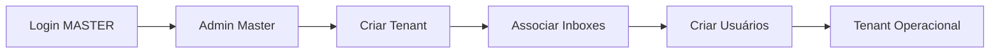
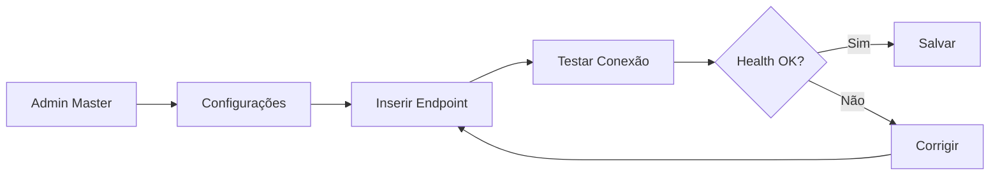

# 🎯 UI Master + Backend Multi-Tenant - Implementação Completa

## ✅ Status: Implementação Concluída

Implementação completa do sistema Master/Tenant para gerenciamento multi-tenant com interface administrativa e APIs REST.

---

## 📦 Arquivos Criados/Modificados

### Backend (Python/FastAPI)

#### APIs Admin (Master)
- ✅ `backend/api/admin.py` - **Atualizado**
  - `GET /api/admin/inboxes` - Listar todos inboxes
  - `GET /api/admin/tenants/{id}/inboxes` - Inboxes de um tenant
  - `POST /api/admin/tenants/{id}/inboxes/bulk` - Associação em massa

### Frontend (React)

#### Services
- ✅ `frontend/app/src/services/adminService.js` - **NOVO**
  - Cliente HTTP para todas APIs Master
  - Gerenciamento de tenants, inboxes, settings, métricas

#### Componentes Master
- ✅ `frontend/app/src/components/Master/AdminMasterLayout.jsx` - **NOVO**
- ✅ `frontend/app/src/components/Master/AdminMasterLayout.css` - **NOVO**
- ✅ `frontend/app/src/components/Master/TenantsList.jsx` - **NOVO**
- ✅ `frontend/app/src/components/Master/TenantsList.css` - **NOVO**
- ✅ `frontend/app/src/components/Master/CreateTenantForm.jsx` - **NOVO**
- ✅ `frontend/app/src/components/Master/CreateTenantForm.css` - **NOVO**
- ✅ `frontend/app/src/components/Master/ManageTenantInboxesModal.jsx` - **NOVO**
- ✅ `frontend/app/src/components/Master/ManageTenantInboxesModal.css` - **NOVO**
- ✅ `frontend/app/src/components/Master/MasterSettingsForm.jsx` - **NOVO**
- ✅ `frontend/app/src/components/Master/MasterSettingsForm.css` - **NOVO**
- ✅ `frontend/app/src/components/Master/MasterMetricsDashboard.jsx` - **NOVO**
- ✅ `frontend/app/src/components/Master/MasterMetricsDashboard.css` - **NOVO**

#### Configuração
- ✅ `frontend/app/src/main.jsx` - **Atualizado** (BrowserRouter)
- ✅ `frontend/app/src/App.jsx` - **Atualizado** (Rotas Master)

### Documentação
- ✅ `docs/MASTER_ADMIN_GUIDE.md` - **NOVO** (Guia completo)

---

## 🚀 Quick Start

### 1. Banco de Dados

```bash
# Aplicar migration (se ainda não aplicou)
cd database
./migrate.sh up
```

**Credenciais Master padrão:**
```
Email: master@dom360.local
Senha: ChangeMe123!
```

### 2. Backend

```bash
cd backend
pip install -r requirements.txt
python server_rbac.py
```

**API disponível em:** `http://localhost:3001`

### 3. Frontend

```bash
cd frontend/app
npm install
npm run dev
```

**UI disponível em:** `http://localhost:5173`

### 4. Acesso Admin Master

1. Login com credenciais MASTER
2. Acesse: `http://localhost:5173/admin/master`
3. Navegue entre:
   - **Tenants** - Gerenciar organizações
   - **Configurações** - SDR Agent endpoint
   - **Métricas** - Dashboard global

---

## 🎨 Funcionalidades Implementadas

### ✅ Backend APIs (MASTER Only)

| Endpoint | Método | Descrição |
|----------|--------|-----------|
| `/api/admin/tenants` | GET | Listar tenants com métricas |
| `/api/admin/tenants` | POST | Criar novo tenant |
| `/api/admin/tenants/{id}` | GET | Detalhes do tenant |
| `/api/admin/tenants/{id}` | PUT | Atualizar tenant |
| `/api/admin/inboxes` | GET | Listar todos inboxes |
| `/api/admin/tenants/{id}/inboxes` | GET | Inboxes de um tenant |
| `/api/admin/tenants/{id}/inboxes` | POST | Associar inbox |
| `/api/admin/tenants/{id}/inboxes/bulk` | POST | Associar múltiplos inboxes |
| `/api/admin/tenants/{id}/inboxes/{inboxId}` | DELETE | Desassociar inbox |
| `/api/admin/master-settings` | GET | Obter configurações |
| `/api/admin/master-settings` | PUT | Atualizar configurações |
| `/api/admin/master-settings/health-check` | POST | Testar SDR Agent |
| `/api/admin/metrics` | GET | Métricas globais |

### ✅ Frontend - Interface Master

**Componentes:**
1. **TenantsList** - Lista com busca, filtros e paginação
2. **CreateTenantForm** - Formulário com validação (nome, slug, Chatwoot)
3. **ManageTenantInboxesModal** - Multi-select de inboxes
4. **MasterSettingsForm** - Configuração SDR Agent + health check
5. **MasterMetricsDashboard** - Cards de métricas com filtros

**Validações:**
- ✅ Slug: apenas `[a-z0-9-]`
- ✅ Endpoint: formato URL válido
- ✅ JSON config: validação em tempo real
- ✅ Health check: latência e status

**UX:**
- ✅ Loading states
- ✅ Error handling
- ✅ Success feedback
- ✅ Mensagens em PT-BR
- ✅ Responsive design

### ✅ Segurança

- ✅ **RBAC**: Endpoints protegidos por role MASTER
- ✅ **Feature gating**: UI escondida para não-MASTER
- ✅ **RLS**: Políticas de banco garantem isolamento
- ✅ **Audit logs**: Todas ações MASTER registradas
- ✅ **JWT**: Autenticação por token

---

## 📊 Fluxos de Uso

### Criar Tenant e Configurar



### Configurar SDR Agent



---

## 🧪 Testes

### Backend (Manual)

```bash
# Login Master
curl -X POST http://localhost:3001/api/auth/login \
  -H "Content-Type: application/json" \
  -d '{"email":"master@dom360.local","password":"ChangeMe123!"}'

# Extrair token e testar APIs
export TOKEN="seu_token_aqui"

curl -H "Authorization: Bearer $TOKEN" \
  http://localhost:3001/api/admin/tenants
```

### Frontend (Manual)

1. Login com MASTER
2. Acesse `/admin/master`
3. Teste cada funcionalidade:
   - Criar tenant
   - Associar inboxes
   - Configurar endpoint
   - Testar health check
   - Visualizar métricas

---

## 🔒 Segurança em Produção

### 1. Alterar Senha Master

```sql
-- Gerar hash bcrypt (Python)
import bcrypt
hash = bcrypt.hashpw(b'SuaSenhaSegura123!', bcrypt.gensalt())
print(hash.decode('utf-8'))

-- Atualizar banco
UPDATE users 
SET password_hash = 'hash_gerado_aqui'
WHERE email = 'master@dom360.local';
```

### 2. Configurar JWT Secret

```bash
# .env
JWT_SECRET=seu_secret_extremamente_forte_aqui_256_bits
```

### 3. HTTPS Obrigatório

```bash
# Frontend .env
VITE_API_URL=https://api.dom360.com

# Backend
# Configurar reverse proxy (Nginx/Traefik) com TLS
```

### 4. Rate Limiting

```python
# Adicionar no server_rbac.py
from slowapi import Limiter
limiter = Limiter(key_func=get_remote_address)
app.state.limiter = limiter
```

---

## 📚 Documentação Adicional

- **Guia Completo**: [docs/MASTER_ADMIN_GUIDE.md](./MASTER_ADMIN_GUIDE.md)
- **RBAC Architecture**: [docs/ADR_MASTER_TENANT_RBAC.md](./ADR_MASTER_TENANT_RBAC.md)
- **API Docs**: [docs/API_DOCUMENTATION.md](./API_DOCUMENTATION.md)
- **Database Schema**: [database/ERD.md](../database/ERD.md)

---

## 🐛 Troubleshooting

### Erro 403 ao acessar /admin/master

**Causa:** Usuário não é MASTER

**Solução:**
```sql
UPDATE users SET role = 'MASTER' WHERE email = 'seu_email';
```

### SDR Health Check falha

**Possíveis causas:**
- SDR Agent offline
- Endpoint incorreto
- Firewall bloqueando

**Solução:**
```bash
# Testar manualmente
curl http://localhost:8000/health
```

### Inboxes não aparecem

**Causa:** Nenhum inbox ativo

**Solução:**
```sql
SELECT * FROM inboxes WHERE is_active = TRUE;
```

---

## 📞 Suporte

- **Issues**: GitHub repository
- **Logs**: `backend/logs/`
- **Audit**: `SELECT * FROM audit_logs WHERE user_role = 'MASTER'`

---

## ✨ Próximos Passos

- [ ] Testes automatizados (Jest + Pytest)
- [ ] CI/CD pipeline
- [ ] Monitoramento (Prometheus/Grafana)
- [ ] Backup automático
- [ ] Multi-região support

---

**Desenvolvido por:** DOM360 Development Team  
**Data:** 15 de outubro de 2025  
**Versão:** 2.0.0
